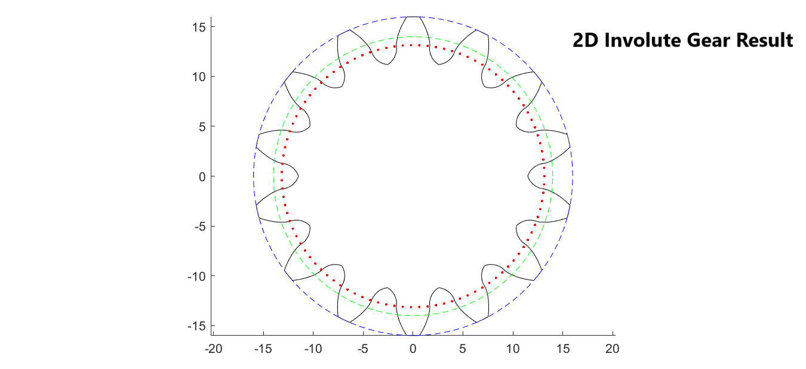

# Involute Gear Analysis — Influence of Tooth Height

A case study analyzing how tooth-height variations affect the structural performance of a 2D involute gear, combining analytical modeling, FEM simulation, and physical prototyping to validate results.

## Overview
This project designed a 2D involute gear profile and investigated how changes in tooth height influence stress distribution and mechanical performance. The design was validated both computationally and physically through 3D printing.

## Tools & Technologies
- **MATLAB** — parametric involute gear profile generation
- **SolidWorks** — stress simulation and structural analysis
- **FDM 3D Printing** — physical prototyping and validation

## Process
1. Modeled the involute gear tooth profile parametrically in MATLAB, allowing tooth-height to be varied systematically.
2. Imported profiles into SolidWorks and ran stress simulations across multiple tooth-height configurations.
3. 3D-printed prototypes via FDM to physically validate the simulated behavior.
4. Documented findings in a technical report and video walkthrough.

## MATLAB Gear Profile

## Results
- Identified how tooth-height variation affects stress concentration and load distribution across the gear profile.
- Cross-validated simulation results against physical prototypes.

## Documentation
- 📄 [Technical Report (PDF)](report/Technical_Report.pdf)
- 📊 [MATLAB Code](code/MATLAB_GearDesign.pdf)
- 🎥 [Video Walkthrough](https://drive.google.com/file/d/1C4bHKdfonE2HVsGdL0NTzIg92vmSuhS3/view?usp=sharing)

## Author
Pratik Malu — [LinkedIn](https://www.linkedin.com/in/pratik-malu-969807190)
